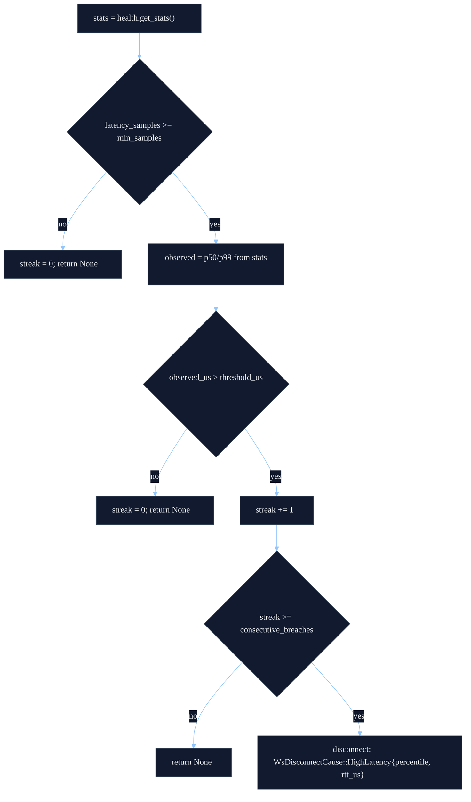

# Latency Policy Hooks (Ping/Pong RTT Only)

`shared-ws` can enforce an RTT-based disconnect policy driven purely by ping/pong timing (no payload
timestamps, no application message parsing). This is intended to shed unhealthy connections early
and let the reconnect logic find a better route/host.

## Data Source: Ping/Pong RTT

RTT samples enter the system only when the ping strategy reports a pong with a measured duration:

- `WsPingPongStrategy::handle_inbound(frame) -> WsPongResult::PongReceived(Some(rtt))`
- The actor calls `health.record_rtt(rtt)` (stores `rtt.as_micros()` into an HDR histogram).

If the strategy returns `PongReceived(None)` (pong recognized but no RTT), the actor **does not**
record a new sample.

## Storage: `WsHealthMonitor` Latency Histogram

`WsHealthMonitor` maintains an `hdrhistogram::Histogram<u64>` of RTT samples in microseconds. From
this it computes:

- `p50_latency_us`
- `p99_latency_us`
- `latency_samples`

These values are surfaced via `health.get_stats()` and drive the latency policy.

## Policy: `WsLatencyPolicy`

The actor is configured with `latency_policy: Option<WsLatencyPolicy>`:

```rust
pub struct WsLatencyPolicy {
    pub percentile: WsLatencyPercentile, // P50 or P99
    pub threshold: Duration,             // compared in microseconds
    pub min_samples: u64,                // required RTT samples before enforcement
    pub consecutive_breaches: u32,       // N successive evaluations over threshold
}
```

The policy is evaluated against the selected percentile (P50/P99). It does **not** look at the most
recent RTT; it looks at the histogram percentile computed over recorded samples.

## Hook Points (Where It Runs)

Latency policy evaluation is wired into the actor in two places:

1. **On pong receive** (`process_inbound`):
   - `PongReceived(Some(rtt))`: record RTT, then evaluate policy.
   - `PongReceived(None)`: evaluate policy (using existing histogram values).
2. **On periodic health tick** (`check_stale`, triggered by the ping loop):
   - After stale checks, evaluate policy.

Stale detection takes precedence: `check_stale()` will disconnect for `ping.is_stale()` or
`health.is_stale()` before considering latency.

```mermaid
%%{init: {'theme':'base','themeVariables':{'background':'#0b1020','primaryColor':'#111a2e','primaryBorderColor':'#334155','primaryTextColor':'#e5e7eb','secondaryColor':'#0f172a','secondaryBorderColor':'#334155','secondaryTextColor':'#e5e7eb','tertiaryColor':'#0b1020','tertiaryBorderColor':'#334155','tertiaryTextColor':'#e5e7eb','lineColor':'#93c5fd','textColor':'#e5e7eb','noteBkgColor':'#0f172a','noteTextColor':'#e5e7eb','actorBkg':'#0f172a','actorBorder':'#334155','actorTextColor':'#e5e7eb','activationBkgColor':'#111a2e','activationBorderColor':'#334155','fontFamily':'ui-monospace, SFMono-Regular, Menlo, Monaco, Consolas, \"Liberation Mono\", \"Courier New\", monospace'}}}%%
sequenceDiagram
  autonumber
  participant S as Server
  participant A as WebSocketActor
  participant P as WsPingPongStrategy
  participant H as WsHealthMonitor

  S-->>A: inbound frame (pong)
  A->>P: handle_inbound(frame)
  alt PongReceived(Some(rtt))
    A->>H: record_rtt(rtt)
    A->>A: evaluate_latency_policy()
  else PongReceived(None)
    A->>A: evaluate_latency_policy()
  else other
    note over A: No RTT sample; no latency eval
  end

  note over A: Periodic tick (ping loop)
  A->>A: check_stale()
  A->>A: evaluate_latency_policy()
```

## Decision Logic (Breach Streak)

Evaluation uses `health.get_stats()` and follows this logic:

- If `latency_samples < min_samples`: do nothing and reset the breach streak to 0.
- If `observed_percentile_us > threshold_us`: increment the breach streak.
  - If the streak reaches `consecutive_breaches`, disconnect.
- Otherwise (within threshold): reset the breach streak to 0.



## Result: Disconnect Cause + Reconnect

When triggered, the actor disconnects with:

- `WsDisconnectCause::HighLatency { percentile, rtt_us }`

This flows through the normal self-healing pipeline:

- endpoint classifies the disconnect (`WsEndpointHandler::classify_disconnect`)
- reconnect strategy decides delay (`WsReconnectStrategy`)

## Implications / Gotchas

- **Ping loop must run** for RTT sampling to be meaningful: strategies typically only report RTT if
  they previously created a ping.
- **No RTT, no samples**: if your ping strategy returns `PongReceived(None)` only, `latency_samples`
  will remain 0 and the policy will never arm (`min_samples` gate).
- **Percentiles are histogram-based**: you are gating on distribution drift, not single spikes.
