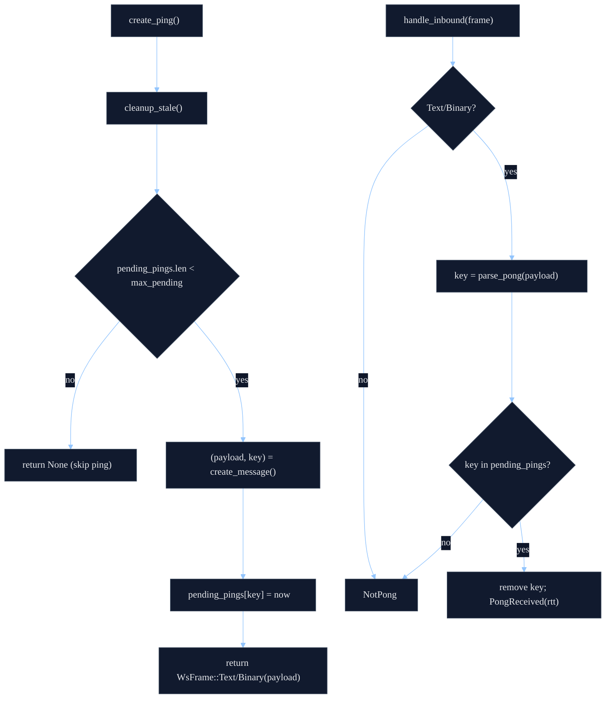

# Pluggable Ping/Pong (Heartbeat) Strategies

`shared-ws` makes ping/pong behavior a pluggable policy so each endpoint can choose how to keep a
connection alive and how to decide it has gone stale.

At the type level, `WebSocketActor<E, R, P, I, T>` is generic over `P: WsPingPongStrategy`.

## Strategy Contract

The ping/pong strategy owns any heartbeat state and is called by the actor at three points:

- Periodically: `create_ping()` to produce an outbound frame (or `None` to skip).
- For every inbound frame: `handle_inbound(frame)` to intercept pings/pongs (and optionally reply).
- Periodically (and before sending a ping): `is_stale()` to request a disconnect when overdue.

In code, the interface is:

```rust
pub trait WsPingPongStrategy: Send + Sync + 'static {
    fn create_ping(&mut self) -> Option<WsFrame>;
    fn handle_inbound(&mut self, message: &WsFrame) -> WsPongResult;
    fn is_stale(&self) -> bool;
    fn reset(&mut self);
    fn interval(&self) -> Duration;
    fn timeout(&self) -> Duration;
}
```

`handle_inbound()` returns:

- `WsPongResult::Reply(frame)`: actor should send `frame` (typically a pong).
- `WsPongResult::PongReceived(rtt)`: strategy recognized a pong and optionally computed RTT.
- `WsPongResult::InvalidPong`: recognized a pong but deemed it invalid (actor records an internal error).
- `WsPongResult::NotPong`: not a ping/pong frame; actor forwards it to the endpoint handler.

## Actor Wiring

When a connection is established, the actor calls `ping.reset()` and (if enabled) starts a ticker
driven by `ping.interval()`. Each tick enqueues two actor messages:

1. `SendPing` (which calls `emit_ping()`).
2. `CheckStale` (which calls `check_stale()`).

`emit_ping()` also checks `ping.is_stale()` before creating/sending a new ping.

Inbound frames are always passed through `ping.handle_inbound()` first. Only frames reported as
`NotPong` are dispatched into endpoint parsing/handling.

```mermaid
%%{init: {'theme':'base','themeVariables':{'background':'#0b1020','primaryColor':'#111a2e','primaryBorderColor':'#334155','primaryTextColor':'#e5e7eb','secondaryColor':'#0f172a','secondaryBorderColor':'#334155','secondaryTextColor':'#e5e7eb','tertiaryColor':'#0b1020','tertiaryBorderColor':'#334155','tertiaryTextColor':'#e5e7eb','lineColor':'#93c5fd','textColor':'#e5e7eb','noteBkgColor':'#0f172a','noteTextColor':'#e5e7eb','actorBkg':'#0f172a','actorBorder':'#334155','actorTextColor':'#e5e7eb','activationBkgColor':'#111a2e','activationBorderColor':'#334155','fontFamily':'ui-monospace, SFMono-Regular, Menlo, Monaco, Consolas, \"Liberation Mono\", \"Courier New\", monospace'}}}%%
sequenceDiagram
  autonumber
  participant T as Ping Ticker Task
  participant A as WebSocketActor
  participant P as WsPingPongStrategy
  participant W as WsWriterActor
  participant E as WsEndpointHandler

  rect rgb(15,23,42)
  note over T,A: Every P.interval()
  T->>A: SendPing
  A->>P: is_stale()
  alt stale
    A->>A: handle_disconnect(StaleData)
  else ok
    A->>P: create_ping()
    alt Some(frame)
      A->>W: WriterWrite(frame)
    else None
      note over A: Skip (e.g. max pending reached)
    end
  end
  T->>A: CheckStale
  A->>P: is_stale()
  end

  rect rgb(15,23,42)
  note over A: For each inbound frame
  A->>P: handle_inbound(frame)
  alt Reply(reply_frame)
    A->>W: WriterWrite(reply_frame)
  else PongReceived(rtt?)
    A->>A: health.record_rtt(rtt?)
  else InvalidPong
    A->>A: health.record_internal_error("ping", ...)
  else NotPong
    A->>E: parse_frame/handle_message(...)
  end
  end
```



## Built-in Strategies

### `ProtocolPingPong`

Implements standard websocket control-frame ping/pong:

- `create_ping()` sends `WsFrame::Ping` and records `last_ping`.
- `handle_inbound()`:
  - On `WsFrame::Pong`: computes RTT as `now - last_ping` and records `last_pong`.
  - On `WsFrame::Ping(payload)`: returns `Reply(WsFrame::Pong(payload))`.
- `is_stale()` becomes true when:
  - the most recent ping is older than `timeout()`, and
  - no pong has been observed *after* that ping.

Use this when the server reliably supports websocket control pings/pongs and you want RTT measured
without endpoint-specific parsing.

### `WsApplicationPingPong`

Implements application-level heartbeat where "ping" and "pong" are normal text/binary frames:

- `create_ping()` calls a caller-provided `create_message: Fn() -> (Bytes, String)` returning:
  - the outbound payload, and
  - a correlation key used to match the pong.
- The strategy tracks pending pings by key, with:
  - `max_pending` to cap in-flight pings, and
  - `timeout()` for expiration.
- `handle_inbound()` calls `parse_pong: Fn(&Bytes) -> Option<String>` and treats a frame as a pong
  only if it yields a key that exists in the pending map.
- `is_stale()` becomes true when the oldest pending ping has exceeded `timeout()`.

Use this when:

- the server/load balancer interferes with control pings/pongs, or
- you need protocol-aware ping/pong semantics (IDs, JSON bodies, etc.).



## Implementing Your Own Strategy

Implement `WsPingPongStrategy` when an endpoint has custom heartbeat rules. Practical guidance:

- Keep `handle_inbound()` conservative: return `NotPong` for frames you do not fully own, so the
  endpoint handler still receives them.
- Make `interval()` the cadence you want *the actor* to drive; it is not auto-adjusted.
- Make `is_stale()` cheap and deterministic; the actor may call it frequently (at least once per tick).
- Use `reset()` to clear all pending state; the actor calls it on successful connect and on disconnect.
