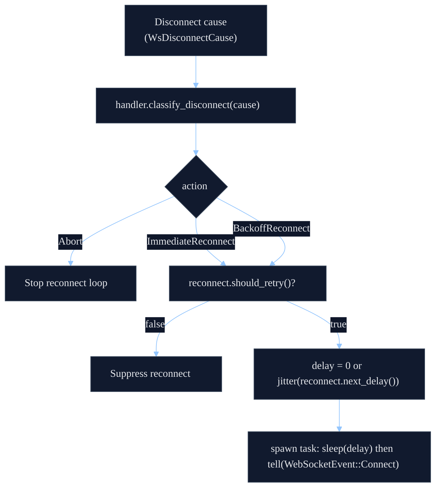
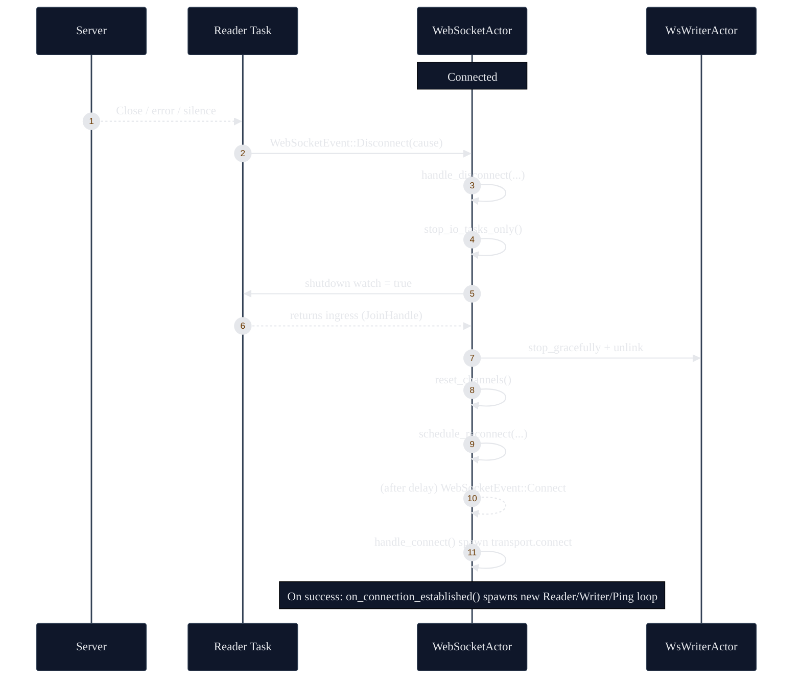

# Self-Healing + State Preservation

`shared-ws` is designed to treat disconnects as routine: the `WebSocketActor` tears down IO tasks,
classifies the failure, and reconnects while keeping endpoint state in-memory so the new connection
can rapidly converge back to the desired subscription/auth state.

## What "Self-Healing" Means Here

The actor will reconnect on many failure modes:

- Remote close (`WsDisconnectCause::RemoteClosed`).
- Handshake/connect failures (`WsDisconnectCause::HandshakeFailed`).
- Internal send/read errors (`WsDisconnectCause::{ReadFailure, InternalError}`).
- Policy-triggered disconnects:
  - ping strategy staleness (`ping.is_stale()`),
  - no inbound activity (`health.is_stale()`), and
  - high latency breaches (optional).

Whether to reconnect immediately, back off, or abort is delegated to the endpoint via
`WsEndpointHandler::classify_disconnect(cause) -> WsDisconnectAction`, and to the reconnect policy
via `R: WsReconnectStrategy` (`should_retry()` + `next_delay()`).



## Task Topology

On each successful handshake, the actor establishes three runtime pieces:

- **Reader task** (Tokio task, outside kameo): reads frames, runs ingress, forwards events.
- **Writer actor** (kameo actor, supervised): serializes and sends outbound frames.
- **Ping loop task** (Tokio task, optional): periodically tells the actor to `SendPing` and
  `CheckStale`.

```mermaid
%%{init: {'theme':'base','themeVariables':{'background':'#0b1020','primaryColor':'#111a2e','primaryBorderColor':'#334155','primaryTextColor':'#e5e7eb','secondaryColor':'#0f172a','secondaryBorderColor':'#334155','secondaryTextColor':'#e5e7eb','tertiaryColor':'#0b1020','tertiaryBorderColor':'#334155','tertiaryTextColor':'#e5e7eb','lineColor':'#93c5fd','textColor':'#e5e7eb','noteBkgColor':'#0f172a','noteTextColor':'#e5e7eb','actorBkg':'#0f172a','actorBorder':'#334155','actorTextColor':'#e5e7eb','activationBkgColor':'#111a2e','activationBorderColor':'#334155','fontFamily':'ui-monospace, SFMono-Regular, Menlo, Monaco, Consolas, \"Liberation Mono\", \"Courier New\", monospace'}}}%%
flowchart LR
  subgraph A["WebSocketActor (kameo)"]
    H["handler: WsEndpointHandler<br/>(includes subscription state)"]
    P["ping: WsPingPongStrategy"]
    R["reconnect: WsReconnectStrategy"]
    M["health: WsHealthMonitor"]
    I["ingress: Option&lt;I&gt;"]
  end

  subgraph RT["Reader Task (tokio)"]
    IO["transport reader loop"]
  end

  subgraph WT["Writer Actor (kameo)"]
    W["WsWriterActor"]
  end

  subgraph PT["Ping Loop (tokio, optional)"]
    T["ticker(interval)"]
  end

  A -->|moves I into task on connect| RT
  RT -->|returns I on exit (JoinHandle)| A
  RT -->|tell(WebSocketEvent::Inbound/Disconnect/InboundActivity)| A
  A -->|tell(WriterWrite)| WT
  PT -->|tell(SendPing, CheckStale)| A
```

## State Preservation (What Survives a Reconnect)

Two pieces of state are explicitly preserved across disconnects:

- `handler: E` stays inside `WebSocketActor` for the lifetime of the actor.
  - This is where "desired subscriptions" typically live (see `WsSubscriptionManager`).
- `ingress: I` is handed into the reader task on connect, and handed back to the actor when the
  reader task terminates (via the task `JoinHandle` return value).

This means adapters can safely keep incremental protocol state (buffers, sequence tracking,
subscription desired sets, etc.) in-memory across reconnects, and the next connection can replay
"desired state" without needing an external checkpoint store.

The integration test `tests/state_recovery.rs` exercises this by updating desired subscription
state while connected, then forcing disconnects (remote close, stale ping), and asserting the next
connection re-sends the full desired subscription set.

## Teardown + Reconnect Loop (Happy Path)

When the actor decides it must disconnect (or the reader task reports a remote close), it:

1. Stops IO tasks and waits for the reader task to return ingress state.
2. Tears down the writer actor.
3. Resets ping state and internal channels/queues.
4. Schedules a reconnect based on classification + backoff policy.



